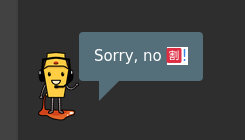

# Fails

## Solved by luck

* NoSQL DOS: a full scan with ZAP unlocked the challenge ^^
* Jim'security answer: I was so stucked that I tried (manually) a very short wordlist composed of common firstnames, which allowed me to succeed
* Secret privacy page: it's only after solving the "real easter egg" challenge that I understood url was "xx/xxx/xxx/xxxx" and not "xxx-xxx-xxx-xx"
* Bully chatbot 

## Tried and Failed so far

* Amy's original password
* acc0unt4nt@juice-sh.op: tried to inject UPDATE statements without success
* HTTP Header XSS
