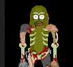

# Steganography

The best candidates for steganographic images are those used in the about page, but, for a long time, I was convinced it was the picture of one of the products.

I analyzed all fuck** images XD! Lost my time. As I did not find anything, I tried the about page: 6 images by default, fair enough.

I lost a lot of time because I missed a critical detail: only one image is a PNG and is significantly heavier than others:

I analyzed the 6 images, found nothing, except for the PNG, of course:

